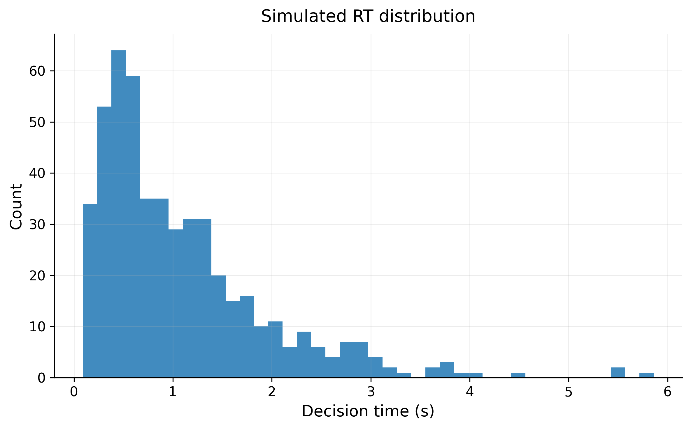
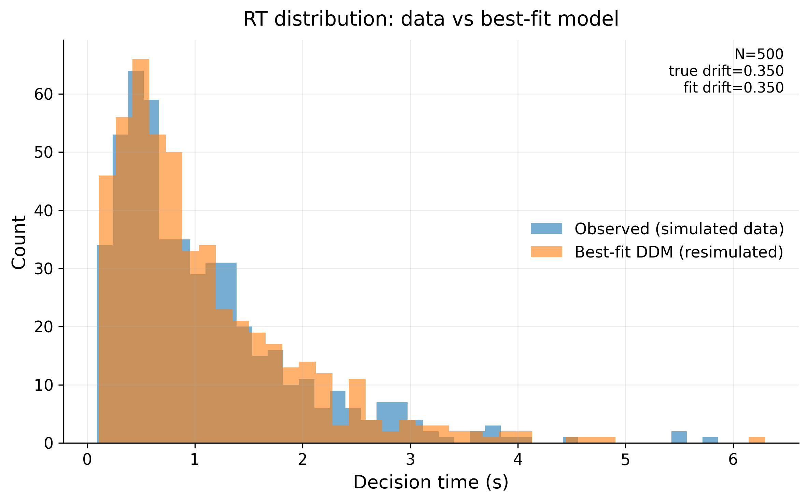

# Drift Diffusion Model (DDM)

Simulation and quick parameter fitting for perceptual decision-making.

This project implements a minimal Drift Diffusion Model (DDM) to simulate
evidence accumulation in binary decision tasks and estimate the drift parameter
using a simple grid-search approach.

---

## Overview

The Drift Diffusion Model is widely used in cognitive neuroscience to model
decision-making processes at the subject level.

This repository:

- Simulates trial-level evidence accumulation
- Generates decision times and binary choices
- Estimates the drift rate parameter
- Produces visual comparison between observed and fitted RT distributions

---
## Project Structure


```text
ddm-perceptual-decision-model/
├── src/
│   └── ddm_model.py              # Core DDM simulation and fitting code
├── results/
│   ├── decision_time_distribution.png   # RT histogram
│   ├── fit_overlay.png                  # Model vs data comparison
│   └── fit_report.txt                  # Fitted parameters and summary stats
├── notebooks/                   # Exploratory analysis (optional)
├── requirements.txt             # Dependencies
└── README.md                    # Project documentation

---
---

## Installation

pip install -r requirements.txt

---

## Run

python src/ddm_model.py

---

## Example Output


Simulated reaction time distribution:



Model fit vs data:

# Drift Diffusion Model (DDM)

Simulation and quick parameter fitting for perceptual decision-making.

